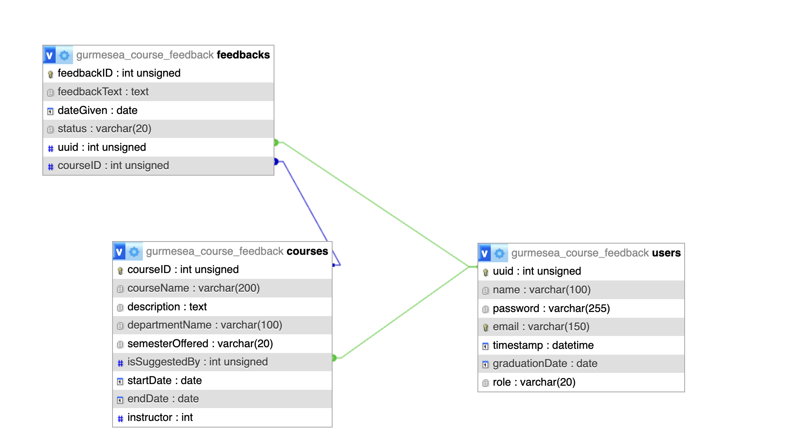

# Clarkson Course Feedback & Suggestion System

Group member names
Eden Abdisa Gurmessa
Sandhya Stalin
Here is Loom video of the app: https://www.loom.com/share/2a6edd844da842c3be64ca9937c632e3

## 1. Project Overview

The system is a web-based application designed for the Clarkson University community to provide insightful feedback on academic courses. The platform aims to improve the learning experience by:

- Collect structured feedback from students on courses they’ve taken
- Allow alumni to suggest new courses based on real-world trends
- Provide faculty and administrators with analytics dashboards for data-driven course and curriculum improvement

Key principles:

- Students can view and edit their feedback.
- Administrators can monitor feedback trends, view summarized analytics, and make data-driven decisions.
- Feedback is only posted after review and approval by an administrator (e.g., validating attendance or enrollment).
- Alumni can suggest new courses based on trends they see in the field, helping Clarkson remain an always-evolving university.

## 2. Objectives

- Develop a centralized system for course feedback collection.
- Provide a mechanism for alumni to suggest new courses.
- Allow students to provide, edit, and review their feedback.
- Enable administrators to analyze feedback trends.
- Improve communication and feedback loops between students (current and alumni), instructors, and departments.
- Allow students to see course feedback to help them decide whether to enroll, beyond just the catalog description.

## 3. Key Features

> **Condition:** This is an app used by the Clarkson community.

### 3.1 Student Features

- View all available courses across departments.
- Give feedback on courses they have taken (current or past semesters).
- View and edit their own previously submitted pending feedback via **My Feedback**.
- Suggest new courses and provide a short description/justification.
- Change their account password and log out.

### 3.2 Alumni Features

- View all available courses.
- Give feedback on courses they previously completed.
- View and edit their own only pending feedback via **My Feedback**.
- Suggest new courses for their department with a description and justification.
- Change their account password and log out.

### 3.3 Admin Features

- View all courses and manage course details.
- Access dashboards and statistics about feedback and course usage.
- Review and approve/reject feedback submissions.
- Manage users: add new users and list existing users.
- Delete clearly inappropriate or invalid feedback.
- Change their account password and log out.

### 3.4 Instructor Features

- View feedback submitted for the courses they teach (via **Feedback for my course**).
- Use feedback to improve course content and teaching.
- Change their account password and log out.

## 4. Rules

- At least there must be one admin added directly to the DB to create other users
- Students and faculty will have to connect with admins to get an account

# 5. Relational Schema

# 6. Setup & Installation

- Clone the Repository
- Take the config.example and add your own credentials
- In the DB which you have created import the DB_scheme
- The sql file has the data populated in it too
- The user password with their role is written below
  | Email | Password | Role |
  | ------------------------------------------------------- | ----------- | ---------- |
  | [edenabdisa90@gmail.com](mailto:edenabdisa90@gmail.com) | P2ssw0rd@90 | admin |
  | [abigya@gmail.com](mailto:abigya@gmail.com) | P2ssw0rd@90 | alumni |
  | [delilah@gmail.com](mailto:delilah@gmail.com) | P2ssw0rd@90 | instructor |
  | [sandhya@gmail.com](mailto:sandhya@gmail.com) | P2ssw0rd@90 | student |

If you are accessing the one from our then you have to select my database from mysql.clarksonmsda.org then use the gurmesea_course_feedback database

# 7. Analytical queries

- Course-related stats (Course model)
  | Category | Function | What the query does | SQL Query |
  | -------- | -------------------------------------- | ------------------------------------------------------------------------------------------------- | -------------------------------------------------------------------------------------------------------------------------------------------------------------- |
  | Course | `get_course_stats_by_department` | Counts **existing courses per department** where `isSuggestedBy IS NULL` (i.e., not suggestions). | `SELECT departmentName, COUNT(*) AS cnt FROM \`{self.tn}` WHERE isSuggestedBy IS NULL GROUP BY departmentName;` |
  | Course | `get_new_course_stats` | Counts **suggested/new courses** where `isSuggestedBy IS NOT NULL`. | `SELECT COUNT(*) AS cnt FROM \`{self.tn}` WHERE isSuggestedBy IS NOT NULL;` |
  | Course | `get_stats_courses_by_department` | Counts **all courses per department**, regardless of suggested or not. | `SELECT departmentName, COUNT(*) AS count FROM \`{self.tn}` GROUP BY departmentName;` |
  | Course | `get_stats_avg_courses_per_department` | Computes the **average number of courses per department**. | `SELECT AVG(course_count) AS avg_courses_per_department FROM ( SELECT departmentName, COUNT(*) AS course_count FROM \`{self.tn}` GROUP BY departmentName ) t;` |

- Feedback-related stats (Feedback model)
  | Category | Function | What the query does | SQL Query |
  | -------- | ---------------------------------------- | -------------------------------------------------------------------------------------------------------------------------------------------------- | ------------------------------------------------------------------------------------------------------------------------------------------------------------------------------------------------------------------------------------------------------------------------------ |
  | Feedback | `get_with_course_and_instructor` | Returns feedback rows **for a specific instructor**, joined with course and user tables, excluding `pending` feedback, ordered by latest feedback. | `SELECT f.*, c.courseName AS courseName, c.instructor AS instructorID, u.name AS name FROM \`{self.tn}`f JOIN`{c.tn}`c ON c.courseID = f.courseID JOIN`{u.tn}` u ON u.uuid = c.instructor WHERE c.instructor = %s AND f.status != 'pending' ORDER BY f.feedbackID DESC;` |
  | Feedback | `get_pending_feedback_count` | Counts **how many feedback items are still pending**. | `SELECT COUNT(*) AS cnt FROM \`{self.tn}` WHERE status = 'pending';` |
  | Feedback | `get_stats_pending_count` | Same core idea as above: counts **pending feedback**, aliased as `c`. | `SELECT COUNT(*) AS c FROM \`{self.tn}` WHERE status = 'pending';` |
  | Feedback | `get_stats_feedback_by_user` | For each user, counts **how many feedback entries they submitted** and the **average feedback text length**. | `SELECT u.uuid, u.name AS name, COUNT(f.feedbackID) AS feedback_count, AVG(LENGTH(f.feedbackText)) AS avg_chars FROM \`{self.tn}` f JOIN users u ON u.uuid = f.uuid GROUP BY u.uuid, u.name ORDER BY feedback_count DESC;` |
  | Feedback | `get_stats_feedback_length_distribution` | Buckets feedback by **text length ranges** (`0–50`, `51–100`, `101–200`, `200+`) and counts how many fall into each bucket. | `SELECT CASE WHEN LENGTH(f.feedbackText) <= 50 THEN '0-50' WHEN LENGTH(f.feedbackText) <= 100 THEN '51-100' WHEN LENGTH(f.feedbackText) <= 200 THEN '101-200' ELSE '200+' END AS bucket, COUNT(*) AS count FROM \`{self.tn}` f GROUP BY bucket ORDER BY bucket;` |
  | Feedback | `get_stats_feedback_char_by_course` | For each course, gets **max feedback length**, **average feedback length**, and **feedback count**, ordered by feedback count. | `SELECT c.courseName AS course, MAX(LENGTH(f.feedbackText)) AS max_chars, AVG(LENGTH(f.feedbackText)) AS avg_chars, COUNT(*) AS feedback_count FROM \`{self.tn}`f JOIN`{c.tn}` c ON c.courseID = f.courseID GROUP BY c.courseID, c.courseName ORDER BY feedback_count DESC;` |

- User/Admin-related stats (Users model)
  | Category | Function | What the query does | SQL Query |
  | ----------- | ------------------------- | --------------------------------------------------------------------------------------------- | ----------------------------------------------------------------- |
  | Users/Admin | `get_admin_stats` | Counts **how many users exist per role** and builds a dict like `{role: count}` for each row. | `SELECT COUNT(*) AS cnt, role FROM \`{self.tn}` GROUP BY role;` |
  | Users/Admin | `get_stats_users_by_role` | Returns **role-wise user counts** with `role` and `count` columns. | `SELECT role, COUNT(*) AS count FROM \`{self.tn}` GROUP BY role;` |
