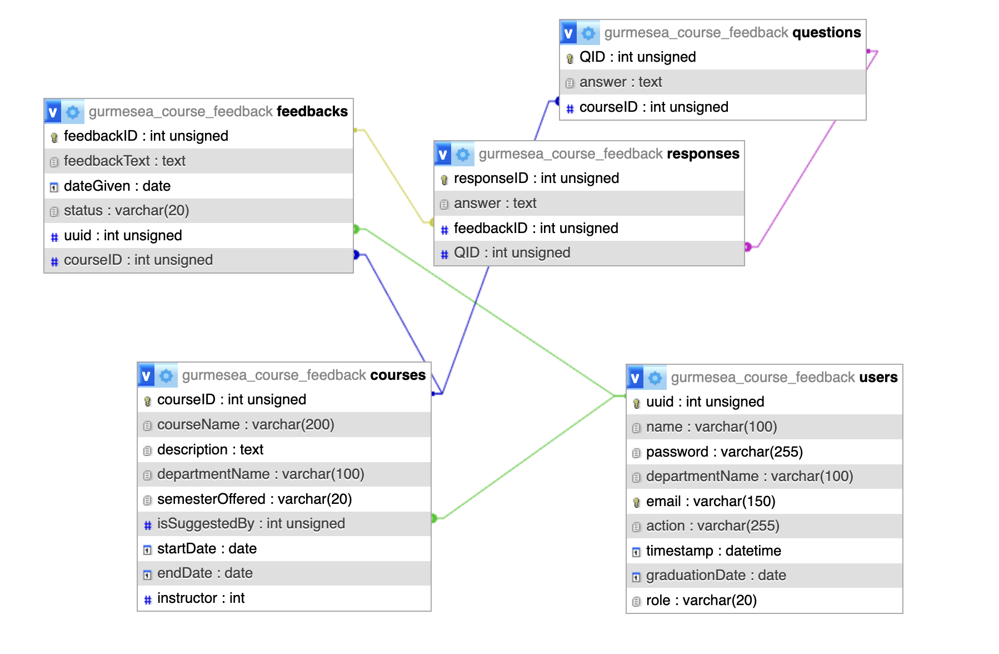

# Clarkson Course Feedback & Suggestion System

A Flask-based web application for the Clarkson University community to:

- Collect structured feedback from students on courses they’ve taken
- Allow alumni to suggest new courses based on real-world trends
- Provide faculty and administrators with analytics dashboards for data-driven course and curriculum improvement

> **Roles supported:** Students, Alumni, Faculty, and Administrators.

# Setup & Installation

## Clone the Repository

flask

## 1. Project Overview

The system is a web-based application designed for the Clarkson University community to provide insightful feedback on academic courses. The platform aims to improve the learning experience by:

- Collecting student feedback
- Offering analytical dashboards for administrators
- Enabling students and alumni to suggest new courses for future semesters

Key principles:

- Students can view and edit their feedback.
- Administrators can monitor feedback trends, view summarized analytics, and make data-driven decisions.
- Feedback is only posted after review and approval by an administrator (e.g., validating attendance or enrollment).
- Alumni can suggest new courses based on trends they see in the field, helping Clarkson remain an always-evolving university.

## 2. Objectives

- Develop a centralized system for course feedback collection.
- Provide a mechanism for alumni to suggest new courses.
- Allow students to provide, edit, and review their feedback.
- Enable administrators to analyze feedback trends.
- Improve communication and feedback loops between students (current and alumni), instructors, and departments.
- Allow students to see course feedback to help them decide whether to enroll, beyond just the catalog description.

## 3. Key Features

> **Condition:** This is an app used by the Clarkson community.

### 3.1 Student Features

- View available and enrolled courses.
- Search and filter courses by name, department, or semester.
- Submit feedback only for courses taken in the current or past semesters.
- Edit feedback.
- View previously given feedback.
- Suggest new courses and provide descriptions.

### 3.2 Alumni Features

- Select a department and suggest a new course.
- Add a description and justification for the new course suggestion.

### 3.3 Faculty / Admin Features

- Add and manage course details.
- Mark which courses are being offered in the current semester.
- Access a dashboard displaying feedback analytics (rating distributions, counts, trends).
- Review and approve/reject new course suggestions.
- Review and approve/reject feedback before publication.
- Delete clearly inappropriate or invalid feedback.

## 6. Database Design

